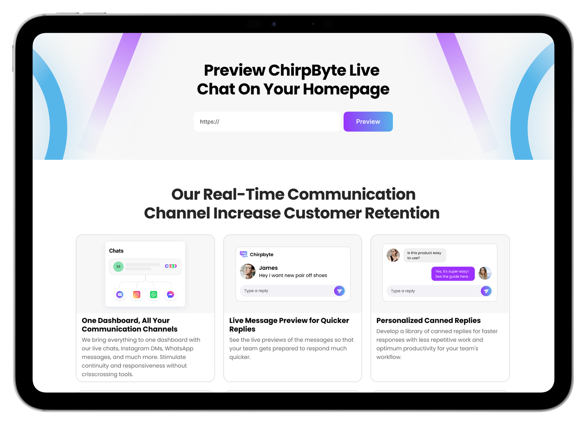
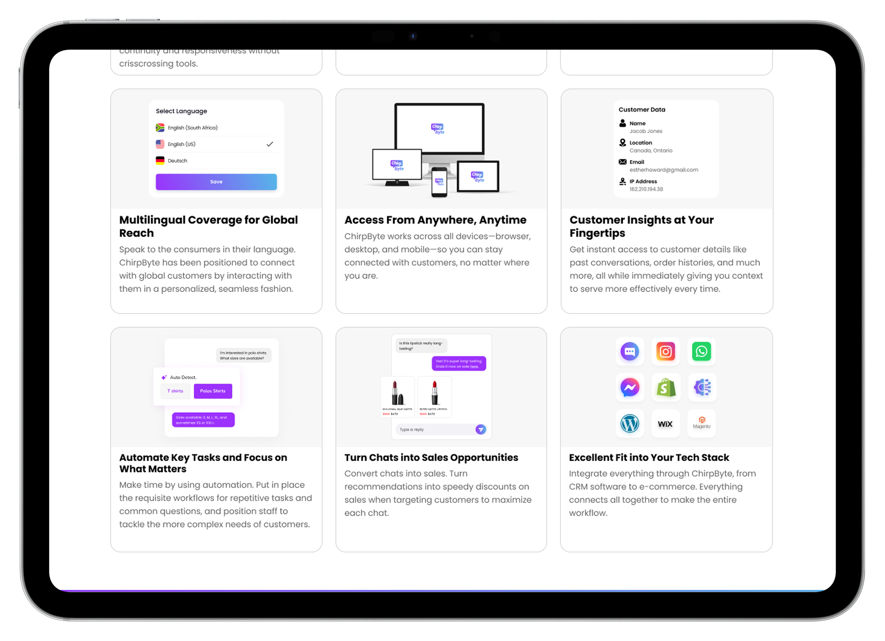
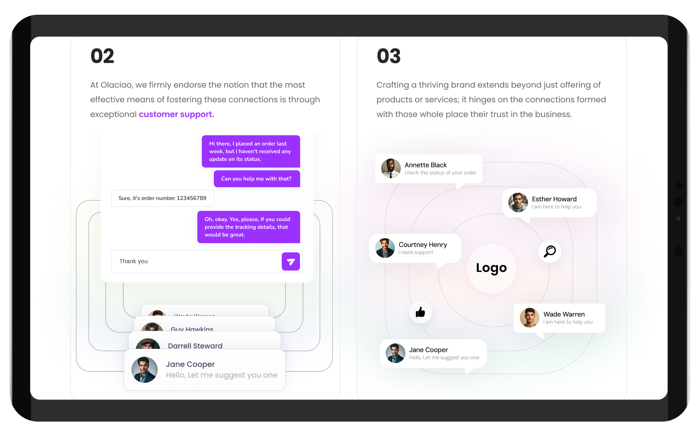

# Chirp-Byte
Chirpbyte aimed to increase its online presence, build brand authority, and to reach more families in need of dementia care. Click Media Lab developed a strategic digital solution plan, which includes website development, SEO, content marketing, and social media engagement.

Chirpbyte, a robust live chatbot system integrating Facebook, WhatsApp, and Instagram, faced idiosyncratic challenges in fostering user engagement and streamlining onboarding. An analysis revealed that 70% of new users felt that the interface was too overwhelming in the first session itself, leading to a 45% drop-off rate when setting up the account. This accounted for a further 20% decrease in lead-conversion potential.

### Main Screenshots

## Live Site
https://chirpbyte.com
